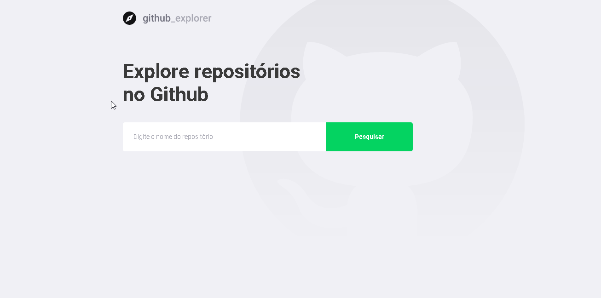

<section align="center">
  
</section>

<section>
  
</section>

## 📋 Sobre

A aplicação Github Explorer serve para buscar e armazenar repositorios do github e foi criada no bootcamp GoStack, para praticar e fixar os conteúdos estudados em **ReactJS** e consumo da API do própio [Github](https://api.github.com)


## 🚀 Tecnologias Utilizadas

Foi desenvolvido usando as seguintes tecnologias:

- [ReactJS](https://pt-br.reactjs.org)
- [Axios](https://github.com/axios/axios)
- [Styled-components](https://styled-components.com)
- [TypeScript](https://www.typescriptlang.org)


## 📦 Como Baixar e Executar o Projeto

```bash

  # Para clonar o repositório para sua maquina

  $ git clone https://github.com/eloilsonrocha/github_explorer.git

  # Para entrar na pasta do projeto
  $ cd github_explorer

  # Para instalar todas as dependências do projeto
  $ yarn

  # Para iniciar a aplicação na port: 3000
  $ yarn start

```


## Licença:

MIT License

Desenvolvido por Eloilson Rocha
